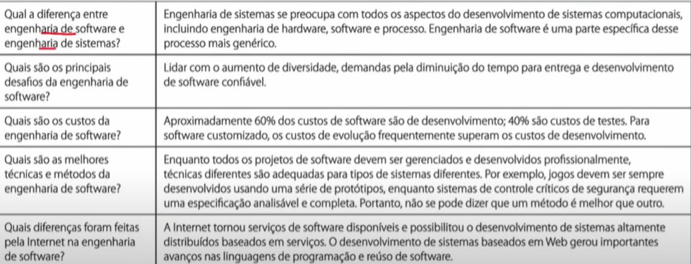
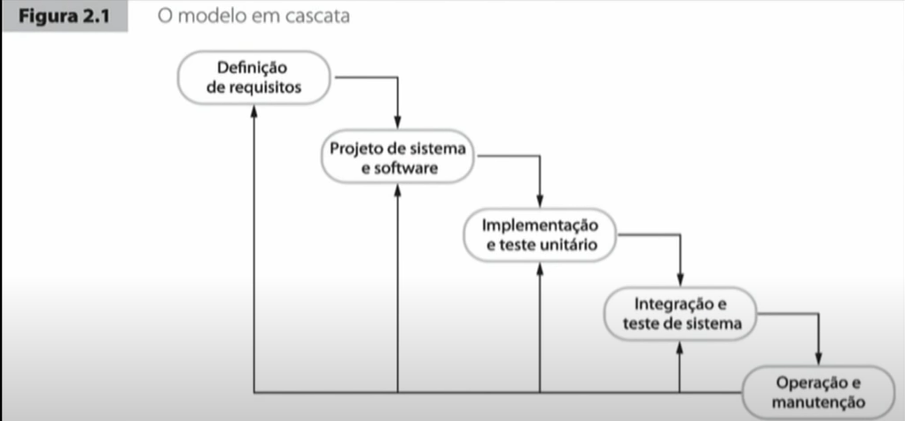
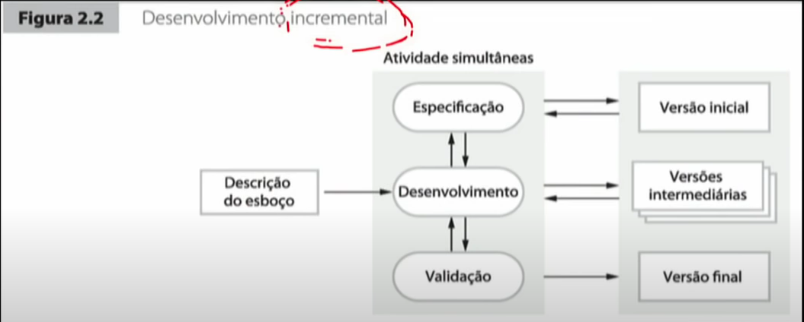
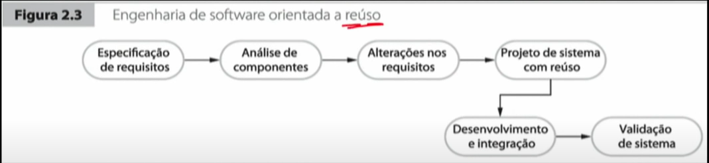
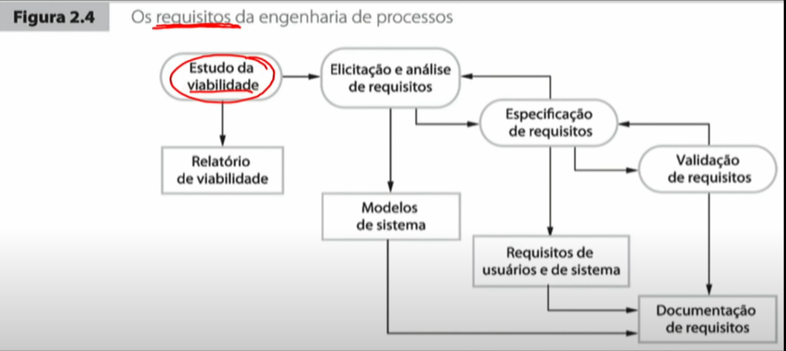
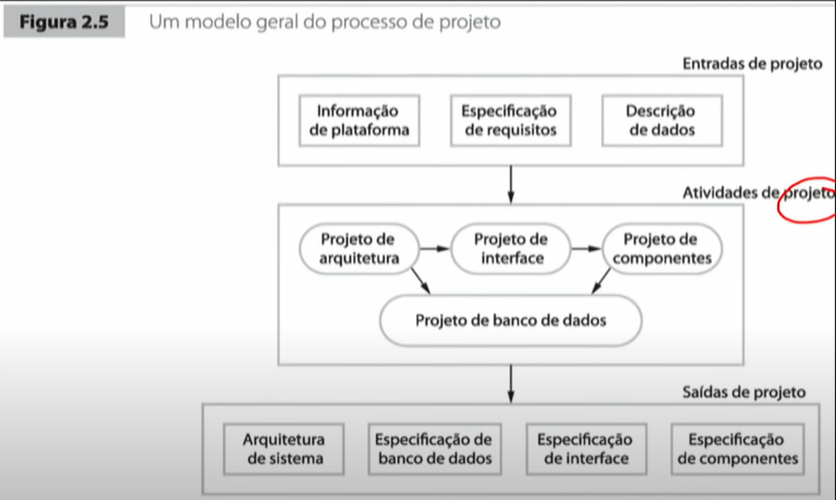
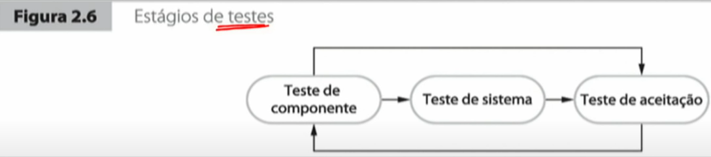
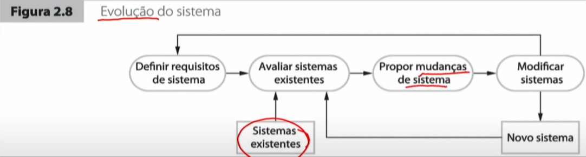

- 0:00 - 3:30  
Processo de software é composto por atividades de software
Um processo de software pode seguir diversos modelos, que são
maneiras de um software de se organizar

- 3:31 - 5:56

- 5:57 - 8:46

- 8:47 - 10:34  
As atividades fundamentais do processo de software são:  
Especificação, projeto, implementação, validação e evolução.

- 10:35 - 15:59  
Os modelos de processo de software mais tradicionais são:
cascata, incremental, orientado a resuo

- 16:00 - 17:04  
Sempre há especificação, desenvolvimento, validação e evolução.

- 17:05 - 18:15  
Todas as etapas podem ser quebradas em pequenos passos

- 18:16 - 19:44

- 19:45 - 20:53

- 20:54 - 22:42
